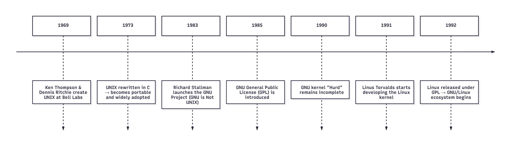
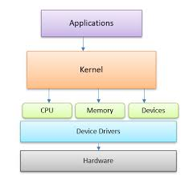

# Linux

## [Command Line](https://labex.io/lesson/the-shell)

---

---

- `pwd` print working directory.
- `cd` change directory.

  - `.` current directory.
  - `..` parent directory.
  - `~` home directory.
  - `-` previous directory.

- `ls` list directories.
- `touch` creating new empty files, or even changing the timestamp.
- `file` determines the type of the file, as linux doesn't rely on the file name extension like Window to determine the file type.
- `cat` Display the content of a single file directly in your terminal.

- `>` : Redirect stdout to a file (overwrite)
- `>>` : Redirect stdout to a file (append)
- `<` : Redirect input from a file
- `2>` : Redirect stderr (errors) to a file
- `2>>` : Append stderr to a file
- `&>` : Redirect both stdout and stderr (overwrite)
- `&>>` : Redirect both stdout and stderr (append)
- `|` : Pipe stdout to another command
- `<<` : Here-document: provide multiline input inline
- `less` displays text in a paged format, allowing you to navigate through a file page by page without loading the entire file into memory.
  - Arrow Keys and Page Keys: Use `Page Up`, `Page Down`, `Up`, and `Down` to navigate line by line or page by page.
  - Go to Start: Press `g` to move directly to the beginning of the text file.
  - Go to End: Press `G (Shift + g)` to jump to the end of the text file.
  - Help Menu: If you forget the commands while inside less, just press `h` to display a helpful summary.
  - `/search_term`: Searches forward for "search_term".
  - `?search_term`: Searches backward for "search_term".
  - `n`: Jumps to the next occurrence of the search term.
  - `N`: Jumps to the previous occurrence.
  - Quit: Simply press `q` to quit the less viewer and go back to your shell.

- `history` show the commands history.

  - Up Arrow: Want to run the same command you just did? Just press the up arrow key to cycle backward through your history.
  - The !! Shortcut: To execute the most recent command again, you can use !!.
  - For example, if you just ran cat file1, typing !! and pressing Enter will run cat file1 again.
  - `CTRL + R` search in history reversely.
  - `history -c` clear history for the current session.
  - `history -d <offset>` delete a specific entry from the history, `<offset>` is the number of the command shown in the history command.
  - `clear` command to wipe your display and start with a fresh screen.
  - `tab` If you start typing the beginning of a command, filename, or directory and press the Tab key, the shell will attempt to autocomplete it. If there are multiple possibilities, it may show you the options or do nothing. Pressing Tab a second time will often list all possible completions.
- `cp` for copying files or directory in linux.

  can be used for renaming files or directories when copying.
  - Using Wildcards for Bulk Copying
    - *: Matches any sequence of characters.
    - ?: Matches any single character.
    - []: Matches any one of the characters enclosed in the brackets.
- `mv` for moving files or directory in linux.

    can be used for renaming files or directories when moving.

- `mkdir` which stands for "Make Directory". This command allows you to create a directory in Linux right from your terminal or command prompt.

- `rm` is a powerful tool for deleting files and directories. However, its power comes with a significant risk. Unlike graphical operating systems, Linux does not have a recycle bin or trash can for command-line deletions. Once you use rm, the files are permanently gone.

- `rmdir` As a safer alternative, you can remove an empty directory with the rmdir command.

- `find` command to search for a file or directory.

- `help` It is specifically designed to provide information about other Bash built-in commands.

- `--help` Shows usage and options for most external programs (not shell built-ins).

- `man` Man pages are the built-in documentation for Linux commands, utilities, and system calls.

- `whatis` In Linux displays a concise, one-line description of a command directly from its manual (man) page.

- `alias` It lets you define a custom name for any command or sequence of commands.

- `exit` Is used to end a shell session.

- `logout` This command is specifically designed to terminate a login shell.

